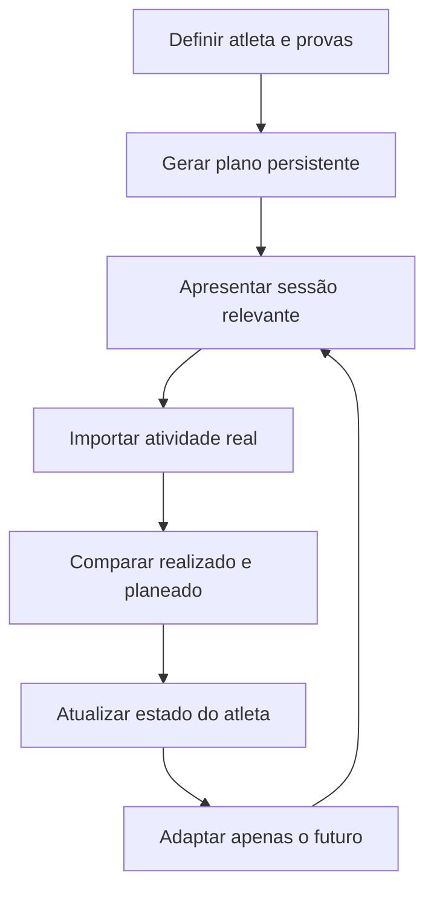

# PerformanceLab

**Compreender o treino. Adaptar com confiança.**

PerformanceLab é uma aplicação open source para atletas amadores de endurance. Combina histórico, fisiologia, provas e disponibilidade para criar um plano persistente, comparar o treino realizado com o planeado e adaptar apenas o futuro.

O objetivo não é impor um calendário rígido nem apresentar dezenas de métricas sem contexto. É ajudar o atleta a perceber:

- o que deve fazer agora;
- como se encontra;
- porque a sessão é adequada;
- o que aconteceu quando o treino real foi diferente;
- se o plano mudou e porquê.

> O plano representa intenção. A realidade do atleta tem prioridade.

---

## Estado do projeto

O PerformanceLab está em **desenvolvimento ativo, antes da primeira UI pública**.

O núcleo de análise e planeamento já é funcional, mas a aplicação atual deve ser executada localmente. Usa:

- Streamlit para a interface;
- ficheiros JSON locais para persistência;
- autenticação de desenvolvimento por email;
- contas de demonstração criadas automaticamente.

Esta versão ainda **não deve ser exposta diretamente à Internet**. Autenticação segura, persistência transacional, proteção de uploads, privacidade operacional e autorização por atleta fazem parte do trabalho necessário antes da publicação.

Consulta o [roadmap até à UI pública](docs/ROADMAP_PUBLIC_UI.md) para o estado e a sequência de evolução.

---

## O ciclo central



O plano completo é gerado uma vez. Depois disso, novas atividades e sessões falhadas são reconciliadas sem regenerar todo o plano em cada acesso.

---

## Funcionalidades atuais

### Atleta e contexto

- perfil pessoal e fisiológico;
- frequência cardíaca máxima, de repouso e de limiar;
- zonas cardíacas manuais e persistentes;
- FTP e perfil nutricional;
- disponibilidade semanal;
- preferências de treino;
- restrições duras de planeamento;
- objetivos e calendário de provas.

### Histórico e importação

- atividades introduzidas manualmente;
- importação GPX;
- importação FIT e FIT.GZ;
- utilização auxiliar do `activities.csv` do Strava para recuperar títulos;
- importação múltipla;
- deteção e combinação de atividades duplicadas;
- RPE manual ou estimado quando existem dados adequados;
- preservação de sensores, contexto e feedback disponíveis.

Não existe ainda sincronização direta com a API do Strava ou de fabricantes.

### Análise

- carga por session-RPE;
- carga aguda e crónica;
- CTL, ATL e TSB;
- ACWR, monotonia e strain;
- estado de treino imutável;
- indicadores de prontidão e recuperação;
- perfil de desempenho;
- ritmos Easy, Tempo e LT2 derivados do histórico;
- zonas de frequência cardíaca, potência e ritmo;
- resumos por modalidade e período.

Estas métricas são indicadores e estimativas, não diagnósticos. Os pressupostos e limites estão documentados em [TRAINING_SCIENCE.md](docs/TRAINING_SCIENCE.md).

### Planeamento

- plano completo persistente até à prova principal e recuperação posterior;
- calendário com várias provas;
- seleção da prova principal por prioridade e exigência;
- fases Maintenance, Base, Build, Peak, Taper, Race, Transition e Regeneration;
- modalidade específica da prova;
- longos preferencialmente ao fim de semana;
- separação de sessões exigentes;
- limite conservador de dias consecutivos;
- progressão semanal de carga e duração;
- progressão de desnível nos longos;
- sessões semânticas como Easy Run, Long Run, Hill Run, Tempo Run, LT2 Run, Technique Run, Pre-Race Run, Shakeout, Recovery e Race;
- prescrições estruturadas com objetivo, intensidade e passos;
- estratégia de prova para cenários atualmente suportados;
- janela semanal móvel sobre o plano completo.

### Reconciliação e adaptação

Depois de uma atividade ou do fecho de um dia, o sistema pode classificar a sessão como:

- `pending`;
- `missed`;
- `equivalent`;
- `modified`;
- `substitute`.

O sistema:

- compara carga planeada e realizada;
- atualiza o estado fisiológico;
- reconhece atividades novas, tardias ou revistas;
- evita processar repetidamente a mesma atividade;
- adapta apenas sessões futuras elegíveis;
- preserva passado, provas, taper e sessões protegidas;
- não move cegamente um treino falhado para o dia seguinte;
- aplica alterações pequenas e conservadoras.

Consulta [PLANNING.md](docs/PLANNING.md) para as regras completas.

### Dashboard

A interface atual apresenta, entre outros elementos:

- atividade mais recente;
- plano de sete dias;
- próxima sessão e respetiva prescrição;
- próxima prova;
- estado fisiológico;
- desempenho;
- recuperação;
- carga de treino;
- resumos de treino;
- detalhe e edição de atividades.

O dashboard está a ser revisto para reduzir ruído, melhorar estados vazios e dar prioridade à decisão mais importante do atleta.

---

## Princípios do produto

- **Atleta primeiro:** o sistema organiza-se em torno da pessoa, não do ficheiro ou dispositivo.
- **Realidade antes do plano:** o passado é preservado e o futuro é adaptado.
- **Carga não é especificidade:** modalidades diferentes podem contribuir para carga sem produzir o mesmo estímulo.
- **Ciência com transparência:** métricas devem indicar método, pressupostos e limitações.
- **Personalização progressiva:** o produto funciona com poucos dados e melhora com o histórico individual.
- **Segurança conservadora:** perante incerteza, prefere-se uma alteração pequena e explicável.
- **Dados do atleta:** fabricantes e serviços externos são fontes substituíveis.
- **Domínio independente:** a UI apresenta; a lógica de treino pertence ao domínio.

Lê a [visão de produto](docs/PRODUCT_VISION.md) e o [manifesto](docs/MANIFESTO.md) para a definição completa.

---

## Arquitetura resumida

O domínio central segue dois fluxos principais:

```text
Event → TrainingPlan → WeeklyPlanBuilder → WeeklyPlan
```

```text
Athlete → AthleteAnalytics → TrainingState / PerformanceProfile → Planner
```

As responsabilidades estão separadas entre:

| Área | Responsabilidade |
|---|---|
| Domínio | Atleta, histórico, provas, estado e regras de treino. |
| Análise | Cálculos e interpretações derivados do histórico. |
| Coaching e planeamento | Estratégia, periodização, sessões e adaptação. |
| Apresentação | Dados preparados e componentes Streamlit. |
| Infraestrutura | Importadores, JSON, ficheiros e autenticação atual. |

Mais informação:

- [Modelo de domínio](docs/DOMAIN_MODEL.md)
- [Arquitetura](docs/ARCHITECTURE.md)
- [Fundamentos científicos](docs/TRAINING_SCIENCE.md)
- [Planeamento](docs/PLANNING.md)

---

## Requisitos

- Python 3.11 ou superior;
- Git;
- PowerShell, terminal macOS ou shell Linux;
- ambiente virtual recomendado.

As dependências da aplicação estão em `requirements.txt`. A metadata do pacote está em `pyproject.toml`.

---

## Instalação local

### Windows PowerShell

```powershell
git clone https://github.com/pedroafrade/PerformanceLab.git
cd PerformanceLab

py -m venv .venv
.\.venv\Scripts\Activate.ps1

py -m pip install --upgrade pip
py -m pip install -r requirements.txt
```

Se a política do PowerShell impedir a ativação do ambiente, executa primeiro, apenas para a sessão atual:

```powershell
Set-ExecutionPolicy -Scope Process -ExecutionPolicy Bypass
.\.venv\Scripts\Activate.ps1
```

### macOS ou Linux

```bash
git clone https://github.com/pedroafrade/PerformanceLab.git
cd PerformanceLab

python3 -m venv .venv
source .venv/bin/activate

python -m pip install --upgrade pip
python -m pip install -r requirements.txt
```

---

## Executar a aplicação

No Windows PowerShell:

```powershell
py -m streamlit run app\app.py
```

No macOS ou Linux:

```bash
python -m streamlit run app/app.py
```

Na primeira execução sem dados locais, a aplicação cria um atleta e duas contas de desenvolvimento:

| Papel | Email |
|---|---|
| Atleta | `demo@performancelab.local` |
| Treinador | `coach@performancelab.local` |

O login atual pede apenas o email. É uma conveniência de desenvolvimento e não um mecanismo seguro de autenticação.

---

## Dados locais

A aplicação atual guarda dados em:

```text
data/
├── athletes/
│   └── <athlete_id>.json
└── users/
    └── <user_id>.json
```

Antes de apagar, substituir ou partilhar estes ficheiros, cria uma cópia de segurança. Podem conter dados pessoais, fisiológicos, localização e histórico de treino.

Não publiques ficheiros reais da pasta `data/` num commit.

---

## Testes

Instala o pytest no ambiente de desenvolvimento:

```powershell
py -m pip install pytest
```

Executa todos os testes:

```powershell
py -m pytest
```

Os testes cobrem domínio, fisiologia, coaching, planeamento, reconciliação, adaptação, persistência, importação e apresentação.

---

## Estrutura do repositório

```text
PerformanceLab/
├── app/                    # Aplicação e componentes Streamlit
├── performancelab/         # Pacote reutilizável e domínio
│   ├── analysis/           # Métricas e perfis derivados
│   ├── coaching/           # Contexto, estratégias e geração
│   ├── history/            # Histórico de atividades
│   ├── importers/          # FIT e GPX
│   ├── physiology/         # Funções fisiológicas
│   ├── presentation/       # Dados preparados para a UI
│   ├── race/               # Provas e participações
│   ├── storage/            # Repositórios e serialização JSON
│   ├── training/           # Configuração, carga e planeamento
│   └── workout/            # Atividades realizadas
├── tests/                  # Testes automatizados
├── docs/                   # Documentação conceptual e roadmap
├── pyproject.toml          # Metadata do pacote
└── requirements.txt        # Dependências da aplicação
```

---

## Documentação

### Referência atual

- [PRODUCT_VISION.md](docs/PRODUCT_VISION.md) — propósito, utilizadores e primeira UI pública;
- [DOMAIN_MODEL.md](docs/DOMAIN_MODEL.md) — conceitos, responsabilidades e invariantes;
- [ARCHITECTURE.md](docs/ARCHITECTURE.md) — camadas, dependências e transição técnica;
- [TRAINING_SCIENCE.md](docs/TRAINING_SCIENCE.md) — métricas, evidência, heurísticas e limites;
- [PLANNING.md](docs/PLANNING.md) — geração, reconciliação e adaptação do plano;
- [ROADMAP_PUBLIC_UI.md](docs/ROADMAP_PUBLIC_UI.md) — sequência até à aplicação pública;
- [AUDIT_CURRENT_STATE.md](docs/AUDIT_CURRENT_STATE.md) — auditoria que iniciou o ciclo atual.

### Fundamentos históricos

- [MANIFESTO.md](docs/MANIFESTO.md)
- [FOUNDATIONS.md](docs/FOUNDATIONS.md)

Documentos e roadmaps antigos serão arquivados para evitar conflito com a referência atual.

---

## Limitações importantes

O PerformanceLab ainda não oferece:

- autenticação adequada a produção;
- base de dados transacional;
- isolamento público validado entre utilizadores;
- sincronização automática com plataformas externas;
- correspondência completa de sessões duplas;
- adaptação distribuída por várias semanas;
- diário detalhado e visível de cada decisão automática;
- suporte igualmente profundo para todas as modalidades;
- aplicação móvel nativa;
- aconselhamento médico.

Métricas de carga, recuperação ou risco não devem ser interpretadas isoladamente. Dor, doença, lesão ou sintomas exigem avaliação adequada e não devem ser resolvidos apenas por adaptação automática do plano.

---

## Contribuir

O projeto está numa fase de consolidação antes da primeira UI pública.

Antes de propor uma alteração relevante:

1. lê a documentação de referência;
2. confirma a versão atual do `main`;
3. mantém a lógica fora da UI;
4. usa objetos de domínio em vez de métricas soltas;
5. preserva imutabilidade quando apropriado;
6. introduz uma alteração pequena e testável;
7. acrescenta ou atualiza testes;
8. documenta pressupostos científicos e limitações.

Issues e pull requests devem explicar o problema do atleta que pretendem resolver.

---

## Licença

PerformanceLab é distribuído sob a [licença MIT](LICENSE).

---

## Autor

Pedro Frade
