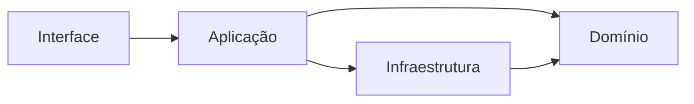
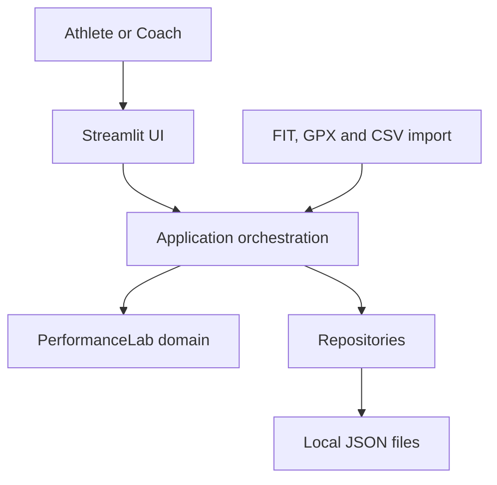
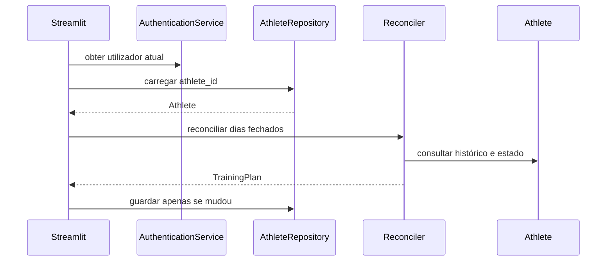
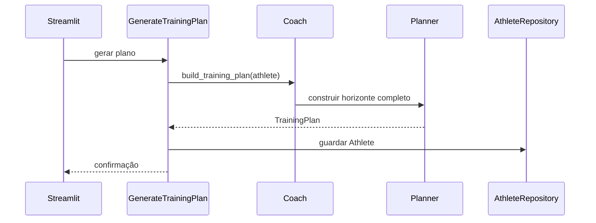
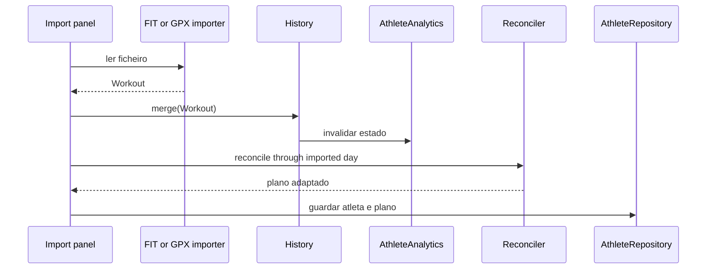

# PerformanceLab — Arquitetura

**Estado:** documento de referência  
**Âmbito:** arquitetura atual, dependências permitidas e direção de evolução  
**Atualizado:** 2 de agosto de 2026

---

## 1. Objetivo

Este documento descreve como o PerformanceLab está organizado, como os seus blocos colaboram e que dependências são permitidas entre eles.

O objetivo arquitetural é proteger o conhecimento de treino das mudanças de interface, armazenamento, importadores e serviços externos. O sistema deve conseguir evoluir do Streamlit e de ficheiros JSON para uma aplicação pública sem reescrever o domínio.

Este documento distingue sempre:

- **estado atual:** o que existe hoje no repositório;
- **arquitetura de referência:** a direção que deve orientar novos commits;
- **transição:** lacunas conhecidas que serão resolvidas progressivamente.

As intenções futuras não são apresentadas como funcionalidades já concluídas.

---

## 2. Princípios arquiteturais

### 2.1. O domínio é independente da interface

As regras de treino, análise e planeamento pertencem ao pacote `performancelab`. Componentes Streamlit recolhem ações e apresentam resultados, mas não devem decidir periodização, carga, recuperação ou adaptação.

### 2.2. Dependências apontam para o conhecimento central

As camadas exteriores podem conhecer as interiores. O domínio não deve conhecer Streamlit, caminhos de ficheiros, JSON ou formatos FIT e GPX.



O diagrama representa a regra de dependência, não uma afirmação de que todas as fronteiras já estão fisicamente separadas no código atual.

### 2.3. Casos de uso coordenam; objetos de domínio decidem

Um caso de uso pode:

- carregar um atleta;
- pedir ao domínio uma operação;
- persistir o resultado;
- devolver uma resposta à interface.

Não deve reproduzir as regras internas dessa operação.

### 2.4. Persistência é substituível

O domínio trabalha com atletas, treinos e planos, não com documentos JSON. Os repositórios atuais são uma implementação local. A passagem futura para uma base de dados não deve alterar as regras do domínio.

### 2.5. Resultados para a UI são preparados antes da renderização

A UI deve receber modelos de apresentação simples e semanticamente claros. Formatação visual pertence à apresentação; interpretação fisiológica pertence ao domínio ou à análise.

### 2.6. Alterações pequenas e verificáveis

A arquitetura evolui por extrações seguras e casos de uso completos. Não se pretende uma reorganização total do repositório num único commit.

---

## 3. Vista geral do sistema



Atualmente, parte de `Application orchestration` ainda vive em `app/app.py` e em componentes Streamlit. A arquitetura de referência prevê a sua extração gradual para serviços de aplicação independentes da UI.

---

## 4. Organização atual do repositório

### 4.1. `performancelab/`

Contém o núcleo reutilizável da aplicação:

| Área | Responsabilidade principal |
|---|---|
| `analysis/` | Cálculo e interpretação do histórico do atleta. |
| `coaching/` | Contexto, análise de coaching, estratégia e geração de sessões. |
| `training/config/` | Disponibilidade, preferências e restrições. |
| `training/planning/` | Plano completo, janela semanal, avaliação, reconciliação e adaptação. |
| `training/load/` | Cálculo de carga planeada e regras associadas. |
| `workout/` | Modelo da atividade realizada e comportamento relacionado. |
| `history/` | Coleção cronológica de atividades realizadas. |
| `race/` | Provas e participações do atleta. |
| `goals/` | Objetivos e respetiva coleção. |
| `physiology/` | Métricas e funções fisiológicas especializadas. |
| `nutrition/` | Perfil e recomendações de nutrição e hidratação. |
| `importers/` | Adaptação de formatos externos para `Workout`. |
| `presentation/` | Construção de dados preparados para apresentação. |
| `storage/` | Serialização e repositórios concretos. |
| `identity/` e `authentication.py` | Utilizadores, papéis e sessão de autenticação atual. |

Nem todas estas áreas correspondem ainda a camadas puras. A sua responsabilidade lógica é mais importante do que o nome da pasta.

### 4.2. `app/`

Contém a aplicação Streamlit:

- configuração e arranque da página;
- login e navegação;
- estado de sessão;
- composição do dashboard;
- formulários e painéis;
- importação iniciada pelo utilizador;
- mensagens, erros e reruns.

`app/components/` deve permanecer focado em interação e renderização. Quando um componente começa a coordenar várias operações de domínio e persistência, essa coordenação é candidata a um serviço de aplicação.

### 4.3. `tests/`

Contém testes de domínio, análise, planeamento, persistência e apresentação.

Os testes são parte da arquitetura: permitem mover coordenação para novas fronteiras sem alterar comportamento.

### 4.4. `data/`

É o armazenamento local da aplicação atual. Cada atleta e utilizador é guardado num ficheiro JSON próprio.

Este diretório é uma decisão de infraestrutura local, não parte do modelo de domínio.

### 4.5. `docs/`

Regista visão, modelo de domínio, arquitetura, fundamentos científicos, regras de planeamento e roadmap.

Documentos conceptuais devem indicar claramente se descrevem comportamento atual, regra normativa ou direção futura.

---

## 5. Camadas de referência

### 5.1. Domínio

Contém conceitos e regras que continuam válidos independentemente da interface ou da persistência.

Inclui:

- `Athlete`, `History` e `Workout`;
- `Goal`, `Event` e `EventEntry`;
- `TrainingPlan`, `PlannedWorkout` e `WeeklyPlan`;
- `TrainingState` e `PerformanceProfile`;
- configurações de treino;
- avaliação de resultados;
- reconciliação e adaptação;
- regras de carga, progressão, recuperação e especificidade.

O domínio pode depender da biblioteca padrão e de módulos internos apropriados. Não pode depender de:

- Streamlit;
- caminhos locais;
- JSON;
- upload de ficheiros;
- estado de sessão da aplicação;
- componentes visuais.

### 5.2. Aplicação

Coordena casos de uso completos.

Responsabilidades esperadas:

- validar o comando recebido da interface;
- carregar agregados através de repositórios;
- invocar serviços e objetos de domínio;
- guardar alterações numa única unidade lógica;
- transformar falhas técnicas em resultados compreensíveis para a apresentação.

Casos de uso naturais do PerformanceLab incluem:

- iniciar sessão;
- carregar o atleta ativo;
- importar atividades;
- gerar o plano completo;
- reconciliar dias fechados;
- editar uma atividade;
- guardar perfil e configurações;
- obter o dashboard atual.

**Estado atual:** ainda não existe um pacote de aplicação consolidado. Esta coordenação encontra-se sobretudo em `app/app.py` e `app/components/import_panel.py`.

### 5.3. Apresentação

Tem duas partes atuais:

1. `performancelab/presentation/`, que prepara estruturas de dados para cartões e páginas;
2. `app/` e `app/components/`, que renderizam esses dados com Streamlit.

Responsabilidades permitidas:

- escolher texto, unidades e formatação;
- organizar cartões, páginas e estados vazios;
- encaminhar comandos do utilizador;
- apresentar sucesso, aviso ou erro.

Responsabilidades proibidas:

- definir limiares fisiológicos;
- decidir se uma sessão deve mudar;
- calcular periodização;
- alterar diretamente o passado para ajustar o plano;
- persistir parcialmente um caso de uso complexo.

### 5.4. Infraestrutura

Implementa detalhes externos:

- repositórios JSON;
- serialização e migração de formatos;
- leitura FIT, FIT.GZ, GPX e CSV;
- sistema de ficheiros;
- futuras bases de dados, armazenamento de objetos e serviços externos.

Os importadores produzem objetos do domínio. Não devem decidir a resposta do plano ao treino importado.

### 5.5. Identidade e acesso

`User` e `AuthenticationService` formam o núcleo atual de identidade e acesso.

O modelo atual:

- distingue papéis `athlete` e `coach`;
- associa uma conta de atleta através de `athlete_id`;
- autentica localmente por endereço de email;
- mantém a sessão autenticada em memória.

Isto é suficiente para desenvolvimento local, mas não constitui autenticação adequada para uma aplicação pública. Palavra-passe, fornecedor de identidade, sessão persistente e autorização rigorosa pertencem à evolução de infraestrutura e aplicação, não ao domínio de treino.

---

## 6. Dependências permitidas

| Origem | Pode depender de | Não deve depender de |
|---|---|---|
| Domínio | Biblioteca padrão, módulos internos de domínio | Streamlit, JSON, ficheiros, estado de sessão |
| Análise e coaching | Objetos e serviços de domínio | Componentes visuais, repositórios concretos |
| Aplicação | Domínio, interfaces de repositório, importadores | Detalhes de layout |
| Apresentação | Casos de uso, modelos de apresentação | Regras científicas duplicadas, serializadores |
| Infraestrutura | Contratos e objetos do domínio | Decisões visuais ou de navegação |

Quando uma dependência proibida surge, a solução preferida é introduzir uma fronteira pequena: função de aplicação, protocolo, modelo de apresentação ou adaptador.

---

## 7. Fachadas e serviços principais

### 7.1. AthleteAnalytics

É a fachada pública para análise do atleta.

Recebe o atleta, delega cálculos especializados e disponibiliza resultados coerentes. O seu cache de `TrainingState` é invalidado quando `History` muda.

Esta fachada evita que a UI, o coaching e o planeamento conheçam a localização de cada cálculo analítico.

### 7.2. Coach

É a fachada pública do motor de coaching.

Atualmente:

- produz recomendações de alto nível;
- delega a geração semanal no `Planner`;
- delega a construção do plano completo no `Planner`.

`Coach` não deve conhecer Streamlit nem persistência.

### 7.3. Planner

Coordena a construção da estratégia, estrutura semanal e sessões concretas.

O fluxo interno atual combina:

- `CoachContext`;
- `CoachAnalyzer`;
- `StrategySelector`;
- estratégia da fase;
- `WeekStructureGenerator`;
- `WorkoutGenerator`;
- `WeeklyPlanBuilder`;
- regras de provas, progressão e recuperação.

O `Planner` trabalha sobre `Athlete` e configurações de domínio. Deve consumir interpretações como `TrainingState`, sem espalhar decisões baseadas diretamente em métricas cruas.

### 7.4. TrainingPlanReconciler

Coordena o processamento de sessões concluídas, atividades novas ou revistas e dias passados sem atividade.

Usa o estado de reconciliação persistido no `TrainingPlan` para impedir que o mesmo resultado seja aplicado repetidamente.

### 7.5. TrainingPlanAdapter

Recebe o plano, resultados elegíveis, estado fisiológico e data de referência. Produz uma revisão conservadora apenas do futuro.

Não conhece a origem da atividade, o botão acionado nem a forma como o plano será guardado.

### 7.6. DashboardData

A classe atual `DashboardData`, em `performancelab/presentation/`, prepara informação para os cartões do dashboard, incluindo atividade recente, fisiologia, próxima sessão, semana, desempenho, recuperação e carga.

O objetivo é que componentes Streamlit façam sobretudo renderização. Cálculos que alterem o significado dos dados devem ser movidos para análise ou domínio; agregação e formatação visual podem permanecer na apresentação.

---

## 8. Fluxos arquiteturais

### 8.1. Arranque e carregamento do atleta



**Estado atual:** este fluxo é coordenado diretamente em `app/app.py`.

**Direção:** encapsular o fluxo num caso de uso `LoadActiveAthlete` ou equivalente, mantendo a reconciliação leve e idempotente.

### 8.2. Geração do plano completo



O plano é persistido. O dashboard obtém janelas semanais sem regenerar o horizonte completo.

**Estado atual:** `app/app.py` chama `Coach().build_training_plan()` e controla a gravação através do estado Streamlit.

### 8.3. Importação e adaptação



**Estado atual:** leitura, RPE automático, merge e reconciliação são coordenados em `app/components/import_panel.py`; a gravação resulta do ciclo da aplicação Streamlit.

**Direção:** criar um caso de uso `ImportActivities` que receba ficheiros já classificados ou fontes de importação e devolva contagens, resultados e plano atualizado. A UI apenas apresenta o resultado.

### 8.4. Construção do dashboard

```text
Athlete
  → AthleteAnalytics
  → DashboardData
  → Streamlit components
```

O dashboard não deve consultar ficheiros nem reconstruir regras do planeador.

---

## 9. Persistência

### 9.1. Repositórios atuais

`JsonAthleteRepository` guarda um atleta por ficheiro, usando `athlete_id` no nome. Oferece operações para obter, listar, guardar e eliminar.

`JsonUserRepository` faz o equivalente para `User` e suporta pesquisa por email.

`UserRepository` já funciona como contrato usado por `AuthenticationService`. A mesma direção deve ser aplicada ao acesso a atletas, para que casos de uso dependam de contratos e não da implementação JSON.

### 9.2. Serialização do atleta

O formato persistido deve conservar:

- identificadores estáveis;
- histórico factual;
- objetivos e participações em provas;
- configurações do atleta;
- plano completo;
- marcas de reconciliação.

Resultados derivados devem ser reconstruíveis sempre que possível.

### 9.3. Versões e migrações

A versão do JSON identifica o contrato de armazenamento. Cada alteração incompatível exige:

- incremento de versão;
- leitura compatível ou migração explícita;
- teste de round-trip;
- preservação de dados anteriores.

A versão do formato não é a versão do produto nem do modelo de domínio.

### 9.4. Unidade lógica de gravação

Uma atividade importada, o histórico resultante e o plano adaptado formam uma única alteração lógica. A arquitetura pública deverá evitar estados em que apenas parte desta alteração fica persistida.

No armazenamento local atual não existe transação real. Até existir uma infraestrutura transacional, os casos de uso devem reduzir ao mínimo os pontos de gravação e guardar apenas depois de todas as regras terminarem com sucesso.

---

## 10. Importadores e fronteiras externas

Cada importador adapta um formato externo para o modelo interno `Workout`.

Responsabilidades:

- ler o formato;
- normalizar unidades e campos;
- construir componentes válidos do treino;
- preservar informação disponível;
- falhar de forma identificável quando o ficheiro é inválido.

Não é responsabilidade do importador:

- adicionar diretamente ao atleta;
- persistir;
- recalcular o plano;
- produzir mensagens Streamlit;
- decidir equivalência com a sessão planeada.

O suporte a novos fornecedores deve entrar através de novos adaptadores, sem alterar `Workout` para refletir peculiaridades de um fornecedor específico.

---

## 11. Estado e cache

### 11.1. Estado de domínio

Pertence aos agregados persistentes: histórico, plano, eventos, objetivos e configurações.

### 11.2. Estado derivado

`TrainingState` e outros resultados analíticos podem ser mantidos em cache, desde que sejam invalidados quando as entradas mudam.

### 11.3. Estado de interface

Seleção de página, mensagens, confirmação de eliminação, editor aberto e ficheiros selecionados pertencem a `st.session_state`.

Estado de interface não deve tornar-se fonte de verdade para o plano ou o histórico.

### 11.4. Sessão autenticada

A autenticação atual é mantida em memória pela instância de `AuthenticationService` guardada na sessão Streamlit. É uma solução local e temporária. Uma UI pública exigirá sessões seguras, expiração e validação no servidor.

---

## 12. Erros e observabilidade

As camadas devem produzir erros no seu nível de abstração:

- importadores identificam ficheiros ou campos inválidos;
- domínio rejeita invariantes violadas;
- aplicação decide se a operação pode continuar ou deve ser anulada;
- apresentação converte o resultado numa mensagem compreensível.

Não se deve usar `except Exception` para esconder silenciosamente erros de domínio. Quando a importação em lote tolera falhas individuais, deve conservar informação suficiente para explicar quais os ficheiros que falharam e porquê.

Mensagens de depuração com `print()` não devem fazer parte do comportamento normal do planeador numa versão pública. A observabilidade futura deve usar logging configurável, sem expor dados pessoais ou de saúde.

---

## 13. Segurança e privacidade

Os dados incluem informação pessoal, fisiológica, localização, histórico desportivo e objetivos. A arquitetura pública deve aplicar:

- autenticação real;
- autorização por recurso;
- isolamento entre atletas;
- armazenamento protegido;
- transporte cifrado;
- validação de uploads;
- limites de tamanho e tipo de ficheiro;
- registo de operações sensíveis;
- possibilidade de exportação e eliminação dos dados do utilizador;
- minimização de dados enviados a serviços externos.

Uma conta de treinador não deve obter acesso implícito a todos os atletas. A relação treinador–atleta deverá ser explícita e autorizada.

---

## 14. Testes por fronteira

| Tipo | Objetivo |
|---|---|
| Domínio | Validar invariantes, estados e regras sem Streamlit ou ficheiros. |
| Análise | Confirmar cálculos, interpretações e invalidação de cache. |
| Planeamento | Verificar periodização, progressão, restrições, reconciliação e adaptação. |
| Persistência | Confirmar versões, migrações e round-trip dos agregados. |
| Importadores | Testar formatos, unidades, campos ausentes e ficheiros inválidos. |
| Apresentação | Confirmar modelos de cartão, estados vazios e formatação. |
| Aplicação | Testar casos de uso completos com repositórios substituíveis. |

Testes de UI não substituem testes de domínio. Um comportamento de treino deve poder ser validado sem iniciar o Streamlit.

---

## 15. Estado atual e dívida arquitetural conhecida

Esta secção é deliberadamente explícita. Registar uma lacuna não invalida o que já funciona; impede que a transição se torne invisível.

### 15.1. Coordenação dentro da UI

`app/app.py` coordena autenticação, criação de dados de demonstração, carregamento, reconciliação, geração do plano, navegação e persistência.

`app/components/import_panel.py` coordena importação, enriquecimento, merge e reconciliação.

**Direção:** extrair casos de uso pequenos, começando pelos fluxos com persistência e várias alterações de domínio.

### 15.2. Repositórios concretos no ponto de entrada

O ponto de entrada instancia diretamente os repositórios JSON.

**Direção:** manter a composição de implementações no exterior, mas entregar contratos aos casos de uso. Isto permitirá substituir JSON sem tocar no domínio.

### 15.3. Autenticação de desenvolvimento

O login por email, contas automáticas de demonstração e sessão em memória não são adequados à aplicação pública.

**Direção:** substituir a infraestrutura de autenticação preservando `User`, papéis e associação explícita ao atleta quando estes conceitos continuarem válidos.

### 15.4. Persistência não transacional

Os ficheiros JSON não oferecem transações para histórico e plano.

**Direção:** concentrar cada alteração num caso de uso e, antes da UI pública, adotar persistência capaz de garantir consistência e concorrência.

### 15.5. Apresentação com interpretação defensiva

Algumas áreas de apresentação procuram campos alternativos e calculam classificações de fallback para suportar a evolução do modelo. `performancelab/presentation/dashboard.py` também importa atualmente Streamlit, apesar de pertencer ao pacote reutilizável.

**Direção:** estabilizar contratos de apresentação, remover a dependência de Streamlit do pacote `performancelab/presentation/` e mover significado científico ou de treino para os módulos apropriados.

### 15.6. Saída de depuração

O `Planner` ainda contém impressões de diagnóstico.

**Direção:** remover ou substituir por logging antes da primeira versão pública.

### 15.7. Mensagens e nomenclatura

Persistem mensagens que chamam “plano semanal” ao plano completo.

**Direção:** alinhar código e UI com a linguagem comum definida em `DOMAIN_MODEL.md`.

---

## 16. Sequência de evolução arquitetural

A evolução deve seguir esta ordem aproximada:

1. estabilizar documentos conceptuais e contratos de domínio;
2. corrigir problemas visuais e estados vazios sem mover regras para a UI;
3. introduzir casos de uso para importação, carregamento/reconciliação e geração do plano;
4. fazer componentes Streamlit dependerem desses casos de uso;
5. estabilizar modelos de apresentação;
6. substituir autenticação de desenvolvimento;
7. adotar persistência preparada para utilizadores públicos e concorrência;
8. acrescentar logging, tratamento de erros e proteção de uploads;
9. validar segurança, privacidade, acessibilidade e operação;
10. publicar uma primeira UI com escopo controlado.

Cada passo deve manter os testes existentes e acrescentar testes na fronteira criada.

---

## 17. Critérios para novas alterações

Antes de introduzir uma classe, módulo ou dependência, deve ser possível responder:

1. Que conceito ou caso de uso representa?
2. Em que camada pertence?
3. Que dados recebe e devolve?
4. Depende de algum detalhe exterior desnecessário?
5. Pode ser testado sem Streamlit?
6. Altera factos, resultados derivados ou decisões futuras?
7. Como é persistida a alteração completa?
8. Que falha pode deixar o sistema num estado parcial?

Se estas respostas não forem claras, a alteração ainda não tem uma fronteira arquitetural suficientemente definida.

---

## 18. Relação com os restantes documentos

- `PRODUCT_VISION.md` define o produto e os princípios de decisão.
- `DOMAIN_MODEL.md` define os conceitos, responsabilidades e invariantes.
- `ARCHITECTURE.md` define camadas, dependências, fluxos e transição técnica.
- `TRAINING_SCIENCE.md` definirá pressupostos e limites científicos.
- `PLANNING.md` definirá as regras detalhadas do motor de planeamento.
- `ROADMAP_PUBLIC_UI.md` organiza a execução até à primeira versão pública.

Quando o código atual divergir da arquitetura de referência, a diferença deve permanecer visível nesta documentação ou no roadmap até ser resolvida. A arquitetura não é uma descrição idealizada; é um contrato de evolução.
