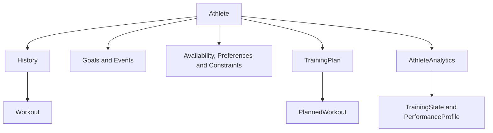
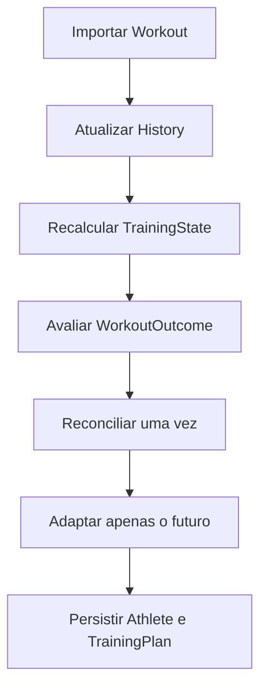

# PerformanceLab — Modelo de Domínio

**Estado:** documento de referência  
**Âmbito:** domínio atual do PerformanceLab e regras para a sua evolução  
**Atualizado:** 2 de agosto de 2026

---

## 1. Objetivo

Este documento define os conceitos centrais do PerformanceLab, as suas responsabilidades e as fronteiras entre factos, interpretações e decisões de treino.

O modelo de domínio deve permitir que a aplicação responda, de forma coerente, a quatro perguntas:

1. Quem é o atleta e em que contexto pode treinar?
2. O que aconteceu realmente no seu treino?
3. Qual é o seu estado atual e o que significa?
4. O que deve acontecer a seguir, tendo em conta objetivos, provas e restrições?

Este documento descreve o domínio. Não define a disposição do dashboard, o formato dos ficheiros de armazenamento nem os detalhes do Streamlit.

---

## 2. Princípios de modelação

### 2.1. O atleta é o centro do domínio

`Athlete` é a raiz do agregado principal. Reúne identidade desportiva, perfil fisiológico configurado, histórico, objetivos, provas, disponibilidade, preferências, restrições e plano de treino.

Isto não significa que `Athlete` deva executar todos os cálculos. Significa que estes dados pertencem ao mesmo contexto desportivo e devem permanecer coerentes entre si.

### 2.2. Factos, interpretações e decisões são conceitos diferentes

- **Factos:** atividades realizadas, datas, duração, distância, sensores e feedback do atleta.
- **Interpretações:** carga, condição, fadiga, forma, recuperação e perfil de desempenho derivados dos factos.
- **Decisões:** sessões planeadas, periodização, progressão, taper e adaptações futuras.

Um facto não deve ser alterado para acomodar uma interpretação. Uma interpretação pode ser recalculada. Uma decisão futura pode ser revista quando surgem novos factos.

### 2.3. A lógica pertence ao domínio

A interface apresenta informação e recolhe ações. Não decide regras de treino, não calcula estado fisiológico e não adapta planos.

A persistência guarda e recupera objetos. Não determina o significado desportivo dos dados.

### 2.4. Imutabilidade por defeito para resultados e configurações

Objetos que representam uma observação calculada, uma configuração coerente ou um resultado de avaliação devem ser imutáveis quando apropriado. Exemplos atuais:

- `TrainingState`;
- `PerformanceProfile`;
- `PlannedWorkout`;
- `WorkoutOutcome`;
- `AthleteAvailability`;
- `AthletePreferences`;
- `TrainingConstraints`.

Agregados com ciclo de vida próprio, como `History` e `TrainingPlan`, podem ser mutáveis através de operações explícitas e validadas.

### 2.5. Identidade apenas quando existe continuidade

Um objeto tem identificador quando precisa de ser reconhecido ao longo do tempo, independentemente de alterações aos seus atributos.

Atualmente:

- `Athlete` tem `athlete_id`;
- `Workout` tem `workout_id`;
- `Event` tem `event_id`;
- `TrainingPlan` tem `plan_id`.

Resultados derivados e configurações não precisam de identidade própria.

---

## 3. Mapa do domínio



O fluxo de planeamento principal é:

```text
Event → TrainingPlan → WeeklyPlanBuilder → WeeklyPlan
```

O fluxo de interpretação e decisão é:

```text
Athlete → AthleteAnalytics → TrainingState / PerformanceProfile → Planner
```

O `Planner` recebe objetos de domínio. Não deve trabalhar diretamente com widgets nem usar CTL, ATL ou TSB como substitutos de uma interpretação de domínio.

---

## 4. Agregado Athlete

### 4.1. Athlete

`Athlete` representa a pessoa no seu contexto de treino.

Responsabilidades:

- manter a identidade do atleta;
- reunir dados pessoais e fisiológicos configurados;
- possuir o histórico, objetivos, inscrições em provas e plano persistente;
- reunir disponibilidade, preferências e restrições;
- disponibilizar o acesso à análise derivada através de `AthleteAnalytics`;
- invalidar resultados analíticos quando o histórico muda.

Não é responsabilidade de `Athlete`:

- renderizar componentes da interface;
- ler ou escrever JSON;
- interpretar ficheiros FIT, GPX ou CSV;
- conter algoritmos completos de planeamento;
- duplicar cálculos que pertencem à análise.

### 4.2. Perfil fisiológico configurado

O atleta pode conter dados como frequência cardíaca máxima, de repouso e de limiar, FTP e zonas cardíacas manuais.

Estes valores são entradas conhecidas ou configuradas. Não devem ser confundidos com estimativas derivadas do histórico. Quando coexistem valores manuais e estimados, a regra de precedência deve ser explícita no domínio.

### 4.3. Nutrição

O perfil nutricional pertence ao contexto do atleta e serve de entrada para recomendações de hidratação e alimentação. Recomendações calculadas não devem ser persistidas como se fossem factos imutáveis quando podem ser novamente derivadas.

---

## 5. Factos de treino

### 5.1. History

`History` é a coleção cronológica de atividades realizadas pelo atleta.

Responsabilidades:

- adicionar, remover, combinar e ordenar `Workout`;
- identificar potenciais duplicados;
- notificar que houve alteração;
- preservar os factos importados ou introduzidos manualmente.

`History` não calcula estatísticas, carga, tendências, condição, fadiga ou prontidão. Esses resultados pertencem à análise.

### 5.2. Workout

`Workout` representa uma atividade efetivamente realizada.

É composto por informação da atividade, ambiente, feedback do atleta e coleção de sensores. Pode expor propriedades de conveniência, como modalidade, data, duração, distância e desnível.

O seu `workout_id` garante continuidade entre importação, persistência e reconciliação. A assinatura de reconciliação oferece uma forma estável de reconhecer atividades quando identificadores externos não são suficientes.

Um `Workout` é um facto. A classificação “equivalente”, “modificado” ou “substituto” não pertence ao próprio treino: só existe quando o treino é comparado com uma sessão planeada.

---

## 6. Intenção, objetivos e provas

### 6.1. Goal e GoalBook

`Goal` representa um objetivo declarado pelo atleta, com nome, descrição, data, prioridade e estado de conclusão.

`GoalBook` organiza os objetivos e permite consultar objetivos ativos, concluídos e o próximo objetivo.

Um objetivo é intenção. Não é uma sessão, uma prova nem um resultado analítico.

### 6.2. Event

`Event` representa a prova ou evento desportivo em si: nome, modalidade, data, distância, desnível, terreno, superfície e localização.

Pode conter comportamento intrínseco à prova, como distância de esforço, exigência de desnível e estimativa de duração a um determinado ritmo.

### 6.3. EventEntry

`EventEntry` representa a participação do atleta num `Event`.

Acrescenta informação específica da participação:

- prioridade;
- tempo-alvo;
- resultado;
- posição;
- estado de conclusão, abandono ou não participação;
- notas.

Esta separação permite que a mesma definição de prova e a experiência concreta do atleta sejam conceitos distintos.

### 6.4. EventBook

`EventBook` é a coleção ordenada de participações do atleta. Expõe provas futuras, concluídas e a próxima prova.

A prova principal orienta a modalidade e a especificidade do plano. Outras provas continuam a fazer parte do calendário e devem ser preservadas pelo planeamento e pela adaptação.

---

## 7. Contexto real de treino

### 7.1. AthleteAvailability

Representa quantos minutos o atleta tem disponíveis em cada dia da semana.

Disponibilidade é uma limitação da vida real. Zero minutos significa indisponibilidade. Não é uma preferência nem uma regra de treino.

### 7.2. AthletePreferences

Representa escolhas desejáveis, mas negociáveis, como dia preferido para o longo, dias preferidos de descanso ou intensidade, modalidades preferidas e preferência por trail.

O planeador deve tentar respeitá-las, mas pode afastar-se delas quando necessário para cumprir segurança, coerência ou restrições duras.

### 7.3. TrainingConstraints

Representa limites que o plano automático não deve violar, como duração máxima, dias bloqueados, número máximo de sessões exigentes, sessões longas, sessões diárias e dias consecutivos de treino.

Uma restrição é uma regra dura. Se não puder ser cumprida, o sistema deve tornar o conflito visível em vez de o ocultar.

---

## 8. Análise derivada

### 8.1. AthleteAnalytics

`AthleteAnalytics` é a fachada de análise associada ao atleta. Converte histórico e perfil em resultados de domínio consumíveis pelo resto do sistema.

Responsabilidades:

- calcular e disponibilizar `TrainingState`;
- calcular e disponibilizar `PerformanceProfile`;
- disponibilizar perfis fisiológicos derivados, quando aplicável;
- gerir a invalidação de resultados em cache após alterações ao histórico.

Os resultados analíticos podem ser recalculados. O histórico que lhes deu origem é a fonte factual.

### 8.2. TrainingState

`TrainingState` é uma fotografia imutável do estado atual do atleta.

Contém métricas de baixo nível, incluindo CTL, ATL, TSB e indicadores de carga, mas oferece ao planeamento conceitos semânticos como:

- condição e fadiga;
- prontidão;
- necessidade de recuperação;
- capacidade para absorver volume;
- tolerância a intensidade;
- indicação para reduzir volume;
- tendência de treino.

O planeador deve consumir estas interpretações. Não deve espalhar pela aplicação regras locais baseadas diretamente em limiares de CTL, ATL ou TSB.

### 8.3. PerformanceProfile

`PerformanceProfile` é uma fotografia imutável das capacidades observadas ou estimadas do atleta, por exemplo ritmos característicos e referências úteis à prescrição.

Descreve “como este atleta tende a executar”. Não descreve “o que deve treinar amanhã”. Essa decisão pertence ao planeamento.

---

## 9. Planeamento

### 9.1. TrainingPlan

`TrainingPlan` é o agregado persistente do planeamento. Representa o plano completo dentro de um horizonte temporal, incluindo preparação, provas e recuperação posterior.

Responsabilidades:

- manter identidade e horizonte do plano;
- conter a sequência completa de `PlannedWorkout`;
- identificar a prova principal e as provas incluídas;
- validar que as sessões pertencem ao horizonte;
- avaliar resultados planeados face ao histórico;
- manter marcas de reconciliação para evitar adaptações repetidas.

O plano é gerado integralmente uma vez e depois revisto de forma incremental. Abrir a aplicação não deve regenerá-lo.

### 9.2. PlannedWorkout

`PlannedWorkout` é uma prescrição imutável para uma data: modalidade, título, duração, distância, desnível, intensidade, objetivo, estrutura, equipamento e fase.

É diferente de `Workout`:

- `PlannedWorkout` é intenção futura;
- `Workout` é atividade realizada;
- a relação entre ambos é produzida pela avaliação de resultado.

### 9.3. WeeklyPlan

`WeeklyPlan` é uma janela móvel de sete dias sobre o `TrainingPlan`.

Serve à apresentação e à utilização imediata. Não substitui o plano persistente, não possui a estratégia completa e não deve ser adaptado isoladamente.

### 9.4. WeeklyPlanBuilder

`WeeklyPlanBuilder` seleciona e organiza a janela semanal a partir do plano completo e da data de referência. Não volta a planear toda a época.

### 9.5. Planner

O `Planner` é um serviço de domínio que cria o plano a partir de objetos do domínio, incluindo atleta, provas, estado, perfil, disponibilidade, preferências e restrições.

Deve preservar:

- coerência da periodização;
- especificidade da prova principal;
- progressão conservadora;
- recuperação adequada;
- provas e sessões protegidas;
- limites declarados pelo atleta.

---

## 10. Reconciliação e adaptação incremental

### 10.1. WorkoutOutcome

`WorkoutOutcome` é o resultado imutável da comparação entre um `PlannedWorkout` e o que foi realizado no mesmo dia.

Os estados são:

| Estado | Significado |
|---|---|
| `pending` | A sessão ainda não chegou ao momento de ser avaliada. |
| `missed` | A sessão passou sem atividade associada. |
| `equivalent` | O estímulo e a carga são suficientemente equivalentes. |
| `modified` | A modalidade é compatível, mas a execução ou a carga diferem. |
| `substitute` | Foi realizada uma modalidade ou estímulo diferente. |

A avaliação inclui carga planeada, carga realizada e respetiva diferença.

### 10.2. TrainingPlanReconciler

O reconciliador coordena a avaliação do plano face ao histórico e determina quais os resultados ainda não processados.

Deve:

- reconhecer atividades novas ou revistas;
- fechar dias passados sem atividade;
- não reaplicar a mesma reconciliação;
- atualizar as marcas persistentes do plano;
- entregar ao adaptador apenas informação elegível.

### 10.3. TrainingPlanAdapter

O adaptador revê apenas o futuro do plano em resposta a resultados processados e ao `TrainingState` atualizado.

Regras fundamentais:

- não alterar treinos passados nem atividades realizadas;
- não regenerar o plano completo;
- não alterar provas, shakeout, taper crítico ou outras sessões protegidas;
- tratar carga e especificidade como dimensões diferentes;
- respeitar progressão, recuperação e dias consecutivos;
- aplicar mudanças pequenas, conservadoras e explicáveis.

### 10.4. Ciclo de atualização



---

## 11. Carga e especificidade

A carga real de qualquer modalidade contribui para o estado fisiológico através da duração e do RPE.

Contudo, carga semelhante não implica estímulo equivalente.

Exemplos:

- ciclismo fácil pode substituir parcialmente uma corrida fácil;
- ciclismo em Z2 pode contribuir para endurance;
- ciclismo em Z2 não substitui automaticamente um treino LT2 de corrida;
- um longo de bicicleta não reproduz toda a exigência musculoesquelética de um longo de trail.

Por isso, o domínio deve conservar duas perguntas distintas:

1. Quanta carga foi realizada?
2. Que especificidade foi realizada?

A modalidade da prova principal continua a orientar a especificidade do plano.

---

## 12. Tempo e fonte da verdade

O domínio tem três zonas temporais:

| Zona | Conteúdo | Regra |
|---|---|---|
| Passado | `Workout` e resultados fechados | Preservar factos; corrigir apenas por ação explícita. |
| Presente | `TrainingState`, `PerformanceProfile` e reconciliação | Recalcular a partir dos factos atuais. |
| Futuro | `PlannedWorkout` no `TrainingPlan` | Pode ser adaptado de forma incremental e protegida. |

O passado factual não é reescrito para justificar o futuro. O futuro é que se adapta ao que realmente aconteceu.

---

## 13. Fronteiras externas ao domínio

### 13.1. Aplicação e interface

A camada de aplicação coordena casos de uso, por exemplo importar uma atividade, gerar um plano ou abrir o dashboard.

A interface:

- recolhe comandos do utilizador;
- apresenta resultados já preparados;
- não contém regras fisiológicas ou de planeamento;
- não altera diretamente estruturas internas do domínio.

### 13.2. Persistência

Repositórios e serializadores guardam e recuperam agregados. A versão do formato JSON é uma preocupação de persistência, não uma versão do domínio.

Devem ser persistidos os factos e decisões necessários à continuidade, incluindo identificadores e marcas de reconciliação. Resultados puramente derivados devem ser reconstruíveis.

### 13.3. Importação

Leitores de FIT, FIT.GZ, GPX e CSV convertem formatos externos em `Workout`. A normalização do formato pertence à infraestrutura; o significado do treino pertence ao domínio.

### 13.4. Identidade e acesso

`User`, autenticação, sessão e permissões pertencem ao contexto de identidade e acesso. Podem referenciar um atleta, mas não devem ser confundidos com o modelo desportivo de `Athlete`.

---

## 14. Invariantes essenciais

O sistema deve preservar, no mínimo, estas regras:

1. Um `Workout` realizado não é substituído por uma prescrição.
2. Um `PlannedWorkout` não é tratado como atividade realizada.
3. O `TrainingPlan` completo é persistente; o `WeeklyPlan` é apenas uma janela.
4. Alterar o histórico invalida o estado analítico dependente.
5. Uma reconciliação já processada não volta a adaptar o plano sem um facto novo ou revisto.
6. A adaptação automática altera apenas sessões futuras elegíveis.
7. Provas e sessões protegidas mantêm-se intactas.
8. Restrições duras prevalecem sobre preferências.
9. Carga comparável entre modalidades não implica especificidade transferível.
10. A UI não é fonte de regras de domínio.
11. Objetos derivados e configurações coerentes são imutáveis quando apropriado.
12. O planeador recebe objetos de domínio, não dados soltos de widgets.

---

## 15. Linguagem comum do produto

Para evitar ambiguidades, a documentação e o código devem usar estes termos:

| Termo | Significado |
|---|---|
| Atividade realizada | `Workout` guardado no `History`. |
| Sessão planeada | `PlannedWorkout` incluído no `TrainingPlan`. |
| Plano completo | `TrainingPlan` persistente até ao fim do horizonte. |
| Plano semanal | `WeeklyPlan`, janela de sete dias. |
| Estado de treino | `TrainingState`, fotografia fisiológica derivada. |
| Perfil de desempenho | `PerformanceProfile`, capacidades derivadas. |
| Resultado da sessão | `WorkoutOutcome`, comparação entre planeado e realizado. |
| Reconciliação | Deteção e processamento único de resultados novos. |
| Adaptação | Revisão conservadora apenas do futuro elegível. |
| Disponibilidade | Tempo real disponível para treinar. |
| Preferência | Escolha desejável que pode ser negociada. |
| Restrição | Limite que o planeamento automático não deve violar. |

---

## 16. Conceitos que não devem voltar a ocupar o centro do modelo

Modelos antigos apresentavam uma cadeia linear `Athlete → History → Workout → Session → Sensor` e atribuíam ao `History` cálculos de estatística e carga. Essa descrição já não representa o PerformanceLab.

`Session` pode continuar a existir como conceito técnico ou legado em áreas específicas, e sensores continuam a compor atividades. Nenhum deles substitui as fronteiras atuais entre histórico factual, análise derivada e planeamento persistente.

Novos conceitos só devem entrar no núcleo quando tiverem responsabilidade própria, linguagem estável e necessidade demonstrada.

---

## 17. Relação com os restantes documentos

- `PRODUCT_VISION.md` define o produto, o público e os princípios de decisão.
- `DOMAIN_MODEL.md` define os conceitos e responsabilidades do domínio.
- `ARCHITECTURE.md` define as camadas, dependências e fluxos técnicos.
- `TRAINING_SCIENCE.md` definirá pressupostos, métricas e limites científicos.
- `PLANNING.md` definirá as regras detalhadas de geração, reconciliação e adaptação do plano.
- `ROADMAP_PUBLIC_UI.md` organiza a sequência de trabalho até à primeira versão pública.

Em caso de divergência entre documentação e código, a divergência deve ser resolvida explicitamente. O código atual não deve ser reinterpretado silenciosamente, e a documentação não deve apresentar intenções futuras como funcionalidades já concluídas.
