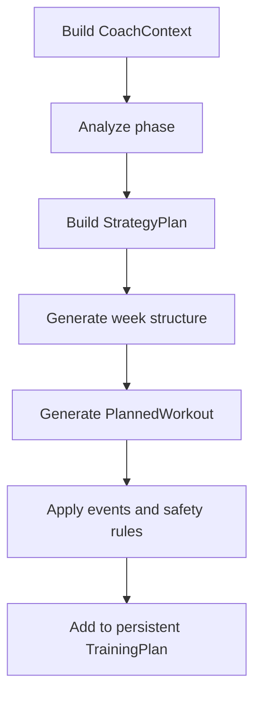

# PerformanceLab — Planeamento de Treino

**Estado:** documento de referência  
**Âmbito:** geração, apresentação, reconciliação e adaptação do plano  
**Atualizado:** 2 de agosto de 2026

---

## 1. Objetivo

Este documento define como o PerformanceLab transforma o contexto do atleta num plano persistente e como esse plano responde ao treino realmente realizado.

Descreve:

- seleção das provas relevantes;
- escolha da prova principal;
- fases de preparação;
- construção do plano completo;
- organização semanal;
- regras de carga, progressão e recuperação;
- preservação de provas e sessões críticas;
- avaliação do que foi realizado;
- reconciliação idempotente;
- adaptação incremental do futuro;
- limitações atuais e direção de evolução.

As regras científicas e respetivas limitações estão em `TRAINING_SCIENCE.md`. Os conceitos e responsabilidades estão em `DOMAIN_MODEL.md`.

---

## 2. Princípios do planeamento

### 2.1. O plano é uma estratégia, não uma ordem rígida

O plano existe para orientar o atleta até às suas provas, mantendo o objetivo de cada sessão e adaptando-se à vida real.

Uma sessão falhada ou modificada não significa que o plano deixou de ser útil. Significa que o futuro deve ser reavaliado de forma proporcional.

### 2.2. O plano completo é persistente

`TrainingPlan` contém o horizonte completo desde a data de geração até à prova principal e à recuperação posterior.

Não deve ser regenerado sempre que:

- a aplicação abre;
- o dashboard muda de semana;
- uma atividade é importada;
- um dia passa sem treino.

Depois da geração inicial, o plano evolui através de reconciliação e adaptação incremental.

### 2.3. O plano semanal é apenas uma janela

`WeeklyPlan` apresenta sete dias selecionados do `TrainingPlan`.

Pode representar:

- a semana de segunda-feira a domingo;
- uma janela centrada num dia, com três dias antes e três depois.

Não contém a estratégia completa e não deve ser persistido como plano independente.

### 2.4. O passado é preservado; o futuro é adaptável

- atividades realizadas são factos;
- sessões planeadas passadas permanecem parte do historial do plano;
- provas realizadas ou futuras são preservadas;
- apenas sessões futuras elegíveis podem ser alteradas automaticamente.

### 2.5. Segurança e coerência prevalecem sobre preenchimento

O objetivo não é ocupar todos os dias disponíveis. O planeador pode deixar descanso quando necessário para cumprir recuperação, carga, progressão, provas e limites de dias consecutivos.

### 2.6. Restrições prevalecem sobre preferências

Disponibilidade e restrições duras definem o espaço possível. Preferências orientam a escolha dentro desse espaço.

### 2.7. Carga e especificidade são dimensões diferentes

Uma atividade pode contribuir para a carga fisiológica sem substituir toda a especificidade da sessão planeada.

O planeamento deve responder separadamente:

1. que carga foi realizada;
2. que estímulo específico continua necessário.

---

## 3. Objetos e serviços

| Elemento | Responsabilidade |
|---|---|
| `CoachContext` | Reunir atleta, estado, perfil, provas e calendário numa leitura coerente. |
| `CoachAnalyzer` | Determinar fase, estratégia e avisos. |
| `StrategySelector` | Escolher a estratégia correspondente à análise. |
| `StrategyPlan` | Descrever objetivos semanais, volume, frequência, foco e recuperação. |
| `WeekStructureGenerator` | Distribuir propósitos de treino pelos dias possíveis. |
| `WorkoutGenerator` | Transformar propósitos em `PlannedWorkout` concretos. |
| `Planner` | Coordenar a construção semanal e do plano completo. |
| `TrainingPlan` | Persistir horizonte, sessões, provas e estado de reconciliação. |
| `WeeklyPlanBuilder` | Extrair janelas de sete dias do plano completo. |
| `WorkoutOutcome` | Registar a comparação imutável entre planeado e realizado. |
| `TrainingPlanReconciler` | Detetar resultados ainda não processados e coordenar a adaptação. |
| `TrainingPlanAdapter` | Rever apenas sessões futuras elegíveis. |

O `Planner` e o adaptador recebem objetos do domínio. Não dependem de Streamlit nem de repositórios JSON.

---

## 4. Entradas do planeamento

### 4.1. Athlete

Fornece:

- histórico realizado;
- estado e perfil derivados;
- provas e objetivos;
- modalidade e experiência observadas;
- perfil fisiológico;
- disponibilidade;
- preferências;
- restrições.

### 4.2. TrainingState

O planeamento consome interpretações como:

- necessidade de recuperação;
- capacidade para absorver mais volume;
- tolerância à intensidade;
- necessidade de reduzir volume;
- volume e frequência semanais habituais;
- duração e desnível habituais do longo.

CTL, ATL e TSB podem existir no objeto, mas regras de planeamento não devem ser duplicadas pela UI nem espalhadas como limiares locais.

### 4.3. PerformanceProfile

Fornece referências relativamente estáveis:

- ritmo LT2;
- ritmo Tempo;
- ritmo fácil;
- frequência cardíaca e zonas;
- potência e FTP;
- outras capacidades observadas.

### 4.4. AthleteAvailability

Define os minutos realmente disponíveis em cada dia da semana. Uma sessão só deve ser colocada onde caiba.

Quando `train_any_day` está ativo, o planeador usa disponibilidade sem restrição semanal.

### 4.5. AthletePreferences

Inclui escolhas suaves, como:

- dia preferido para o longo;
- dias preferidos de descanso;
- dias preferidos para intensidade;
- modalidades preferidas;
- preferência por trail;
- evitar sessões duplas.

### 4.6. TrainingConstraints

Inclui limites duros, como:

- minutos máximos por semana e sessão;
- limites de dias úteis e fim de semana;
- dias bloqueados;
- dias sem intensidade;
- máximo de intensidade e longos;
- máximo de sessões por dia;
- recuperação mínima;
- dias consecutivos de treino.

---

## 5. Calendário de provas

### 5.1. Horizonte de eventos

`CoachContext` considera atualmente eventos registados entre a data de referência e os 365 dias seguintes.

### 5.2. Bloco competitivo

O primeiro bloco cronológico de provas futuras é construído agrupando provas consecutivas separadas por, no máximo, oito semanas.

Quando o intervalo excede oito semanas, começa outro ciclo de planeamento.

### 5.3. Prova principal

Dentro do bloco competitivo, a seleção segue esta ordem:

1. prioridade declarada pelo atleta;
2. distância de esforço da prova de corrida;
3. duração-alvo;
4. ordem cronológica, favorecendo a mais próxima em caso de igualdade.

A prova principal determina:

- horizonte global do plano;
- modalidade principal;
- especificidade dominante;
- progressão do longo;
- preparação e recuperação final.

### 5.4. Prova que determina a fase

A prova principal orienta o ciclo geral. Contudo, se a próxima prova estiver a 14 dias ou menos, essa prova mais próxima determina a fase atual.

Isto permite preservar taper e semana de prova para eventos intermédios sem perder a estrutura do bloco completo.

### 5.5. Identidade das provas

O plano persiste:

- `primary_event_id`;
- `competition_event_ids`.

As relações não dependem apenas do nome ou da data, evitando ambiguidades quando uma prova é editada.

---

## 6. Fases

### 6.1. Seleção temporal atual

| Situação | Fase |
|---|---|
| Sem prova futura | `Maintenance` |
| Mais de 84 dias | `Base` |
| 43 a 84 dias | `Build` |
| 15 a 42 dias | `Peak` |
| 8 a 14 dias | `Taper` |
| 0 a 7 dias | `Race` |
| Pós-prova recente ou data ultrapassada | `Regeneration` |

Uma necessidade forte de recuperação pode selecionar `RegenerationStrategy` mesmo quando a fase temporal seria outra.

### 6.2. Maintenance

Objetivo:

- manter condição geral quando não existe prova próxima;
- equilibrar consistência, variedade e recuperação;
- evitar progressão orientada para uma competição inexistente.

### 6.3. Base

Objetivo:

- desenvolver base aeróbia;
- consolidar consistência;
- preparar progressão posterior;
- manter intensidade controlada e não dominante.

### 6.4. Build

Objetivo:

- aumentar carga sustentável;
- desenvolver endurance;
- introduzir intensidade controlada;
- manter um longo;
- aproximar progressivamente o treino das exigências da prova.

O código atual parte de um fator de volume de 1,08 e reduz a ambição quando a fadiga ou o RPE recente estão elevados.

### 6.5. Peak

Objetivo:

- aumentar especificidade;
- preservar qualidade;
- reduzir algum volume excedente;
- manter um longo reduzido;
- criar espaço suficiente entre sessões-chave.

O código atual usa duas sessões de intensidade quando o contexto permite e escolhe estímulos complementares, evitando repetir cegamente o mesmo foco.

### 6.6. Taper

Objetivo:

- reduzir fadiga acumulada;
- reduzir substancialmente o volume;
- preservar estímulo breve e controlado;
- evitar novos estímulos ou progressões.

Se a fadiga estiver elevada, a intensidade pode ser removida.

### 6.7. Race

Objetivo:

- proteger a prontidão;
- minimizar carga não essencial;
- incluir shakeout ou ativação quando apropriado;
- tratar a prova como a carga principal da semana;
- anexar estratégia de execução quando suportada.

### 6.8. Transition e Regeneration

Objetivo:

- recuperar de prova ou fadiga elevada;
- remover intensidade e longos;
- retomar movimento fácil de forma gradual;
- preparar o próximo ciclo.

`Transition` pode representar recuperação entre provas próximas do mesmo bloco. `Regeneration` também pode ser ativada por fadiga, independentemente do calendário.

---

## 7. Geração do plano completo

### 7.1. Horizonte

Quando existe prova principal:

```text
início = data de geração
fim = data da prova principal + 7 dias de recuperação
```

Sem prova futura, o plano atual cobre apenas a semana relevante.

### 7.2. Construção por semanas

O `Planner` percorre semanas consecutivas dentro do mesmo `TrainingPlan`:



Cada semana conhece a sessão final da semana anterior, o longo anterior e a carga semanal anterior. Isto permite proteger as fronteiras entre semanas.

### 7.3. Semana inicial parcial

Na primeira semana:

- os dias anteriores à data de geração são bloqueados;
- apenas sessões dentro do horizonte do plano são adicionadas;
- a semana parcial não estabelece uma baseline completa de carga para progressão futura.

### 7.4. Plano sem regeneração implícita

Mudar a janela semanal ou abrir a aplicação não chama `build_training_plan()`.

A geração completa ocorre apenas quando o utilizador pede explicitamente a criação de um plano novo.

---

## 8. Construção semanal

### 8.1. Estratégia antes do calendário

A estratégia define primeiro:

- fase;
- minutos e carga-alvo;
- número de sessões;
- número de sessões exigentes;
- número de longos;
- dias de recuperação;
- foco principal e secundário;
- especificidade;
- objetivo de desnível;
- avisos.

Só depois a estrutura distribui esses propósitos pelos dias disponíveis.

### 8.2. Propósitos de sessão

O planeamento usa propósitos semânticos, transformados posteriormente em prescrições concretas.

Exemplos atuais:

- easy aerobic;
- long endurance;
- hills;
- tempo;
- threshold/LT2;
- VO₂max;
- technique;
- pre-race;
- shakeout;
- recovery;
- race.

### 8.3. Títulos e prescrições

`WorkoutGenerator` produz `PlannedWorkout` com:

- modalidade;
- título;
- duração;
- distância e desnível quando aplicável;
- intensidade;
- objetivo;
- estrutura passo a passo;
- resumo de prescrição;
- equipamento;
- fase.

A UI apresenta estes dados; não reconstrói o objetivo da sessão.

### 8.4. Modalidade

A modalidade da prova principal orienta as sessões específicas. Provas e respetivos shakeouts preservam a modalidade registada no evento.

Modalidades alternativas podem preencher trabalho aeróbio quando adequado, mas não devem eliminar necessidades específicas da modalidade principal.

---

## 9. Regras de segurança e coerência

### 9.1. Dias consecutivos

O planeamento automático aplica atualmente um máximo conservador de dois dias consecutivos de treino, mesmo quando a restrição configurada pelo atleta permitir mais.

Uma restrição do atleta mais rigorosa continua a prevalecer.

### 9.2. Separação entre longo, prova e intensidade

Uma sessão exigente deve ocorrer com diferença mínima de dois dias após um longo ou prova. Na prática, existe pelo menos um dia intermédio.

A regra atravessa fronteiras semanais. Se não existir dia seguro:

- a sessão pode ser deslocada para um dia livre;
- ou removida quando não existe solução coerente.

### 9.3. Sessões exigentes

O planeador reconhece atualmente títulos e descrições associados a:

- tempo;
- LT2 e threshold;
- intervalos;
- hills;
- speed;
- VO₂max.

Esta identificação deve evoluir para metadados explícitos, evitando dependência excessiva de texto.

### 9.4. Limite de progressão de carga semanal

Entre semanas completas consecutivas, a carga planeada não deve crescer mais de 10%.

Quando uma semana ultrapassa o limite:

1. reduz-se proporcionalmente a duração de sessões ordinárias;
2. preservam-se longos, provas, shakeouts e pre-race;
3. se necessário, remove-se uma sessão exigente adicional;
4. depois podem ser consideradas outras sessões ordinárias;
5. sessões protegidas permanecem.

O limite é uma heurística conservadora do produto, conforme descrito em `TRAINING_SCIENCE.md`.

### 9.5. Progressão do longo

Em `Build` e `Peak`, quando existe um longo anterior:

- o alvo seguinte progride pelo menos cinco minutos;
- não ultrapassa os minutos semanais disponíveis;
- pode ser limitado por 75% da duração estimada da prova;
- o teto baseado na prova não é inferior a 90 minutos.

O volume semanal total permanece controlado; aumentar o longo implica redistribuir minutos dentro da semana, não somar carga sem limite.

### 9.6. Progressão de desnível

Para provas rolling, hilly ou mountainous, o longo pode progredir a partir do desnível habitual do atleta.

A progressão é uma regra prática. Deve respeitar experiência, terreno disponível e carga global.

### 9.7. Recuperação após prova exigente

Provas exigentes bloqueiam recuperação imediata e influenciam a estrutura da semana seguinte. A fase de regeneração reduz volume, elimina intensidade e impede que o ciclo seguinte comece como se a prova não tivesse acontecido.

---

## 10. Proteção de sessões

Sessões protegidas não devem ser reduzidas, aumentadas, deslocadas ou removidas automaticamente pela adaptação incremental.

O adaptador protege atualmente:

- todas as sessões das fases `Taper` e `Race`;
- provas;
- shakeout;
- pre-race;
- recovery.

O gerador semanal também preserva prova, shakeout, pre-race e longo durante várias correções de carga.

Esta proteção existe para evitar que uma correção local destrua a estrutura da competição.

---

## 11. Estimativa e execução de prova

### 11.1. Duração esperada

A duração-alvo introduzida pelo atleta tem prioridade.

Quando não existe, o sistema pode estimar a duração a partir do histórico de corrida. A origem da estimativa é anexada à sessão de prova para apresentação.

### 11.2. Estratégia de execução

O suporte atual inclui estratégias específicas para:

- corrida de estrada aproximadamente entre 8 e 12 km;
- trail running com 15 km ou mais.

As estratégias podem incluir:

- segmentos por percentagem de duração;
- orientação por ritmo ou esforço;
- frequência cardíaca como guia;
- hidratação;
- hidratos de carbono e sódio;
- técnica e gestão do terreno.

Eventos não suportados não devem receber uma estratégia genérica apresentada como específica.

---

## 12. WeeklyPlan e apresentação

### 12.1. Semana de calendário

`WeeklyPlanBuilder.week(day)` devolve segunda-feira a domingo.

### 12.2. Janela móvel

`WeeklyPlanBuilder.window(center_day)` devolve:

- três dias anteriores;
- o dia central;
- três dias posteriores.

### 12.3. Regra de apresentação

A janela deve mostrar:

- sessões planeadas;
- atividades realizadas;
- estado do resultado quando aplicável;
- fase e contexto da prova;
- prescrição da sessão selecionada.

Não deve alterar o `TrainingPlan` por navegar entre semanas.

---

## 13. Avaliação do realizado

### 13.1. Associação temporal

`TrainingPlan.assess_outcomes()` indexa atividades pelo dia e compara cada `PlannedWorkout` com uma atividade realizada nesse dia.

### 13.2. Estados

| Estado | Condição atual |
|---|---|
| `pending` | Não há atividade e o dia ainda não está fechado. |
| `missed` | Não há atividade e o dia já passou. |
| `equivalent` | Mesma família de modalidade e diferença relativa de carga até 20%. |
| `modified` | Mesma família, mas carga fora da tolerância ou informação insuficiente. |
| `substitute` | Família de modalidade diferente. |

### 13.3. Famílias atuais

As modalidades são normalizadas para:

- running;
- cycling;
- swimming;
- other ou o valor normalizado.

Trail running pertence à família running para a primeira classificação, embora a especificidade de terreno continue diferente.

### 13.4. Diferença de carga

```text
load_difference = carga realizada − carga planeada
```

- positivo: carga superior;
- negativo: carga inferior;
- zero ou dentro da tolerância: potencialmente equivalente;
- `None`: dados insuficientes para comparar carga.

### 13.5. Limitação de associação por dia

A associação atual é centrada na data e é adequada ao modelo automático de uma sessão diária. Sessões duplas, várias atividades no mesmo dia ou uma atividade que combine dois objetivos exigirão uma regra explícita de correspondência futura.

---

## 14. Reconciliação

### 14.1. Objetivo

Reconciliação significa descobrir que partes do plano fechado ainda não foram processadas.

Não significa gerar o plano novamente.

### 14.2. Estado persistido

`TrainingPlan` guarda:

- `reconciled_through`;
- `reconciled_workout_ids`;
- `reconciled_workout_signatures`.

Isto permite reconhecer:

- dias novos que ficaram no passado;
- atividades importadas tardiamente;
- atividades já processadas;
- atividades revistas depois da primeira importação.

### 14.3. Assinatura de atividade

A assinatura de reconciliação inclui informação relevante como:

- dia;
- modalidade normalizada;
- duração;
- RPE efetivo.

Se esta informação mudar, a atividade pode ser reavaliada sem ser tratada como uma importação completamente desconhecida.

### 14.4. Reconciliação ao importar

Depois de importar ou atualizar atividades:

1. o histórico é atualizado;
2. o cache de `TrainingState` é invalidado;
3. o estado é recalculado quando solicitado;
4. o plano é reconciliado até ao último dia importado relevante;
5. os resultados ainda não processados são enviados ao adaptador;
6. atleta e plano atualizado são persistidos.

### 14.5. Reconciliação ao abrir a aplicação

Ao carregar o atleta, `reconcile_closed_days()` processa até ontem.

O dia atual permanece aberto porque a sessão ainda pode ser realizada mais tarde.

Se nada mudou, o mesmo objeto pode ser devolvido e não é necessária nova gravação.

### 14.6. Idempotência

Executar a reconciliação repetidamente com os mesmos dados não deve aplicar novamente a mesma adaptação.

Esta regra é essencial: sem ela, uma redução de 10% poderia ser repetida em cada acesso até destruir o plano.

---

## 15. Adaptação incremental atual

### 15.1. Princípio

O adaptador recebe:

- plano atual;
- resultados ainda não processados;
- `TrainingState` atualizado;
- data de referência.

Devolve um novo `TrainingPlan` com a mesma identidade, horizonte, provas e estado de reconciliação, alterando apenas sessões futuras elegíveis.

### 15.2. Sessão equivalente

Não altera o futuro.

### 15.3. Carga superior ao planeado

São considerados resultados `modified` ou `substitute` com diferença positiva.

Se `TrainingState.should_reduce_volume` for verdadeiro:

- calcula-se a carga excedente relativamente à carga planeada;
- responde-se a 25% dessa proporção;
- a redução máxima é 20% da duração;
- reduz-se a próxima sessão exigente futura e não protegida.

Se o estado não indicar redução de volume, o plano permanece inalterado.

### 15.4. Treino falhado ou carga inferior

São considerados:

- `missed`;
- `modified` com diferença negativa;
- `substitute` com diferença negativa.

Se `TrainingState.can_absorb_more_volume` for verdadeiro:

- calcula-se a carga em falta conhecida;
- tenta-se recuperar apenas 25% dessa diferença;
- o aumento máximo é 5% da duração;
- aumenta-se a próxima sessão fácil, futura e não protegida;
- dá-se preferência à família da modalidade planeada em falta.

O treino falhado nunca é simplesmente movido para o dia seguinte.

### 15.5. Substituição

A carga realizada é contabilizada. A resposta de volume depende de a carga ter ficado acima ou abaixo.

A proteção das fases e sessões críticas evita destruir especificidade próxima da prova. Contudo, o adaptador atual não cria automaticamente uma nova sessão específica para compensar cada substituição. Esta é uma limitação deliberadamente conservadora.

### 15.6. Ausência de candidato seguro

Se não existir sessão futura elegível, o adaptador não força uma alteração.

Não cria uma nova sessão, não viola a proteção e não desloca treino para um dia ocupado.

---

## 16. Exemplos de adaptação

### 16.1. Easy Run equivalente

Planeado: 60 minutos de corrida fácil.  
Realizado: corrida da mesma família e carga dentro de 20%.

Resultado:

- `equivalent`;
- estado atualizado;
- futuro inalterado.

### 16.2. Sessão muito acima da carga

Planeado: sessão moderada.  
Realizado: mesma modalidade, carga claramente superior.  
Estado: indica necessidade de reduzir volume.

Resultado possível:

- `modified`;
- redução limitada da próxima sessão exigente não protegida;
- prova e taper intactos.

### 16.3. Treino falhado

Planeado: corrida fácil.  
Realizado: nada até ao fecho do dia.  
Estado: permite absorver volume.

Resultado possível:

- `missed`;
- pequeno aumento na próxima sessão fácil elegível;
- sessão falhada não é copiada;
- não é criado um terceiro dia consecutivo.

### 16.4. Ciclismo no lugar de LT2 Run

Planeado: LT2 Run.  
Realizado: ciclismo Z2.

Resultado:

- `substitute` por família diferente;
- carga cardiovascular contabilizada;
- não é considerado automaticamente estímulo LT2 específico de corrida;
- adaptação de volume permanece conservadora;
- sessões protegidas da prova mantêm-se.

### 16.5. Atividade importada tardiamente

Um dia já tinha sido marcado como `missed`, mas uma atividade antiga é importada depois.

Resultado:

- o identificador ou assinatura revela informação nova;
- o dia fechado é reavaliado;
- a mesma atividade não é reaplicada em acessos seguintes.

---

## 17. Invariantes

O planeamento deve preservar:

1. `TrainingPlan` é o plano persistente completo.
2. `WeeklyPlan` nunca substitui o plano completo.
3. Abrir a aplicação não regenera o plano.
4. Uma atividade realizada não é apagada por uma adaptação.
5. Uma sessão passada não é reescrita como se tivesse sido cumprida.
6. Reconciliação repetida com os mesmos dados é idempotente.
7. Só sessões futuras elegíveis são adaptadas.
8. Provas, taper, shakeout, pre-race e recovery são protegidos.
9. Um treino falhado não é copiado automaticamente para o dia seguinte.
10. A progressão semanal permanece limitada.
11. O limite automático de dias consecutivos é respeitado.
12. Restrições duras prevalecem sobre preferências.
13. Carga alternativa não apaga automaticamente a especificidade da prova.
14. A UI apresenta decisões; não as calcula.
15. Uma alteração deve ser pequena, explicável e testável.

---

## 18. Limitações atuais

### 18.1. Correspondência simples por data

O sistema ainda não resolve de forma completa sessões duplas, atividades compostas ou várias atividades candidatas no mesmo dia.

### 18.2. Classificação de especificidade inicial

As famílias running, cycling e swimming são úteis, mas insuficientes para distinguir:

- trail técnico e estrada;
- corrida fácil e LT2;
- ciclismo indoor e exterior;
- duração contínua e intervalos;
- estímulo metabólico e musculoesquelético.

### 18.3. Deteção baseada em texto

Parte da identificação de sessões fáceis, exigentes e protegidas usa títulos, descrições ou fase.

A evolução deve introduzir metadados de domínio explícitos, como propósito, exigência e nível de proteção.

### 18.4. Adaptação concentrada numa sessão

A correção atual atua na próxima sessão exigente ou fácil elegível. Ainda não distribui uma diferença por várias semanas.

### 18.5. Sem diário de decisão completo

O plano guarda o resultado final e o estado de reconciliação, mas ainda não persiste uma explicação estruturada de cada alteração para auditoria e UI.

### 18.6. Regras fixas

Tolerância de 20%, resposta de 25%, aumento máximo de 5% e redução máxima de 20% são regras conservadoras gerais, ainda não personalizadas pelo historial de resposta do atleta.

### 18.7. Conflitos e transações

O armazenamento JSON local não oferece transações ou resolução de concorrência. Uma aplicação pública precisará de garantir que histórico, plano e marca de reconciliação são guardados em conjunto.

---

## 19. Evolução prevista

A próxima evolução do motor deve ser incremental:

1. estabilizar metadados explícitos de propósito, exigência e proteção;
2. melhorar a correspondência entre sessões planeadas e atividades múltiplas;
3. separar equivalência de carga, modalidade e estímulo;
4. persistir um registo explicável das adaptações;
5. distribuir correções pequenas por mais de uma sessão quando fizer sentido;
6. personalizar limites a partir da resposta histórica do atleta;
7. integrar disponibilidade extraordinária, doença, dor e feedback de recuperação;
8. rever o plano quando uma prova é adicionada, alterada ou removida;
9. suportar ciclos posteriores ao primeiro bloco competitivo;
10. mostrar ao atleta o que mudou, porquê e com que grau de confiança.

Estas melhorias não devem introduzir regeneração completa automática em cada acesso.

---

## 20. Testes do planeamento

### 20.1. Seleção e calendário

Devem cobrir:

- prova principal por prioridade e exigência;
- blocos com várias provas;
- prova próxima a determinar taper;
- horizonte até recuperação posterior;
- identidade persistente das provas.

### 20.2. Fases e estratégias

Devem cobrir:

- limites temporais de cada fase;
- regeneração por prova e fadiga;
- redução por RPE elevado;
- modalidade específica;
- rotação e complementaridade dos estímulos.

### 20.3. Estrutura semanal

Devem cobrir:

- disponibilidade e preferências;
- restrições duras;
- fins de semana e longo;
- separação de sessões exigentes;
- fronteiras semanais;
- dias consecutivos;
- semanas parciais.

### 20.4. Progressão

Devem cobrir:

- carga semanal máxima;
- preservação de sessões protegidas;
- progressão de longo e desnível;
- ausência de crescimento quando o estado não permite.

### 20.5. Reconciliação

Devem cobrir:

- todos os estados de `WorkoutOutcome`;
- dias falhados;
- atividades tardias;
- atividades revistas;
- identificadores e assinaturas;
- idempotência;
- dia atual ainda aberto.

### 20.6. Adaptação

Devem cobrir:

- equivalente sem alteração;
- carga superior com e sem necessidade de redução;
- carga inferior com e sem capacidade de absorção;
- treino falhado;
- substituição;
- limites de 5% e 20%;
- preferência pela modalidade;
- ausência de candidato;
- proteção de taper, prova e recovery;
- preservação de identidade e horizonte.

---

## 21. Linguagem de produto

### 21.1. Gerar

Criar um novo `TrainingPlan` completo. É uma ação explícita e excecional.

### 21.2. Reconciliar

Detetar resultados fechados ou atividades novas/revistas que ainda não foram processados.

### 21.3. Adaptar

Alterar de forma conservadora apenas o futuro elegível do plano existente.

### 21.4. Apresentar

Construir uma janela ou cartão sem alterar o plano.

### 21.5. Regenerar

Substituir o plano completo por outro. Este termo não deve ser usado para reconciliação nem para navegação semanal.

---

## 22. Relação com os restantes documentos

- `PRODUCT_VISION.md` define para quem e para quê existe o planeamento.
- `DOMAIN_MODEL.md` define `TrainingPlan`, `WeeklyPlan`, resultados e serviços.
- `ARCHITECTURE.md` define as fronteiras entre UI, aplicação, domínio e persistência.
- `TRAINING_SCIENCE.md` define o significado e as limitações das métricas utilizadas.
- `PLANNING.md` define como o sistema gera, reconcilia e adapta o plano.
- `ROADMAP_PUBLIC_UI.md` organiza as melhorias até à primeira UI pública.

O planeamento do PerformanceLab deve manter uma promessa simples: gerar uma estratégia coerente uma vez, aprender com o que realmente aconteceu e adaptar apenas o que ainda pode ser mudado.
